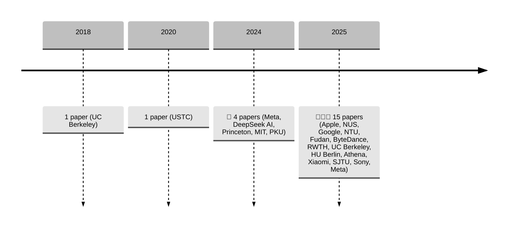

#   Awesome Multi-Token Prediction (MTP!)

> *A curated list of papers, tools, and resources on Multi-Token Prediction (MTP) and related techniques in Large Language Models (LLMs), Speech-Language Models (SLMs), and more.*

Multi-Token Prediction (MTP) is an emerging paradigm that enhances the efficiency and capability of language and multimodal models by allowing them to predict multiple tokens simultaneously. This repository collects recent research and implementations in this exciting direction.

---

## 🔬 Recent Papers (2025)

| Title | Institution | Year | Paper | Code |
|------|-------------|------|-------|------|
| **MiMo-V2-Flash Technical Report** | Xiaomi | 2025 | [PDF](https://github.com/XiaomiMiMo/MiMo-V2-Flash/blob/main/paper.pdf) | [Code](https://github.com/XiaomiMiMo/MiMo-V2-Flash) |
| **FastMTP: Accelerating LLM Inference with Enhanced Multi-Token Prediction** | Tencent | 2025 | [PDF](https://arxiv.org/pdf/2509.18362) | [Code]([Tencent-BAC/FastMTP](https://github.com/Tencent-BAC/FastMTP)) |
| **Beyond Multi-Token Prediction: Pretraining LLMs with Future Summariesn** | Meta | 2025 | [PDF](https://arxiv.org/pdf/2510.14751) | - |
| **Enhancing Visual Planning with Auxiliary Tasks and Multi-token Prediction** | Meta | 2025 | [PDF](https://arxiv.org/pdf/2507.15130) | - |
| **Your LLM Knows the Future: Uncovering Its Multi-Token Prediction Potential** | Apple | 2025 | [PDF](https://arxiv.org/pdf/2507.11851v1) | - |
| **L-MTP: Leap Multi-Token Prediction Beyond Adjacent Context for Large Language Models** | NUS | NeurIPS 2025 | [PDF](https://arxiv.org/pdf/2505.17505) | [Code](https://github.com/Xiaohao-Liu/L-MTP) |
| **Roll the dice & look before you leap: Going beyond the creative limits of next-token prediction** (Outstanding paper) | Google | ICML 2025 | [PDF](https://arxiv.org/pdf/2504.15266) | - |
| **Improving Large Language Models with Concept-Aware Fine-Tuning** | NTU | 2025 | [PDF](https://arxiv.org/pdf/2506.07833) | [Code](https://github.com/michaelchen-lab/caft-llm) |
| **Speech-Language Models with Decoupled Tokenizers and Multi-Token Prediction** | Fudan University | 2025 | [PDF](https://arxiv.org/pdf/2506.12537) | [Code](https://github.com/cnxupupup/SLM-Decoupled-MTP) |
| **Chain-of-Action: Trajectory Autoregressive Modeling for Robotic Manipulation** | ByteDance Seed | 2025 | [PDF](https://arxiv.org/pdf/2506.09990) | [Project Page](https://chain-of-action.github.io/) |
| **DONUT: A Decoder-Only Model for Trajectory Prediction** | RWTH Aachen University | 2025 | [PDF](https://arxiv.org/pdf/2506.06854) | [Code](https://vision.rwth-aachen.de/DONUT) |
| **Generating Long Semantic IDs in Parallel for Recommendation** | UC Berkeley | KDD 2025 | [PDF](https://arxiv.org/pdf/2506.05781) | [Code](https://github.com/facebookresearch/RPG_KDD2025) |
| **Pre-Training Curriculum for Multi-Token Prediction in Language Models** | Humboldt-Universität zu Berlin | 2025 | [PDF](https://arxiv.org/pdf/2505.22757) | [Code](https://github.com/aynetdia/mtp_curriculum) |
| **Multi-Token Prediction Needs Registers** | Athena Research Center | NeurIPS 2025 | [PDF](https://arxiv.org/pdf/2505.10518) | - |
| **MiMo: Unlocking the Reasoning Potential of Language Model – From Pretraining to Posttraining** | Xiaomi | 2025 | [PDF](https://arxiv.org/pdf/2505.07608) | [Code](https://github.com/xiaomimimo/MiMo) |
| **VocalNet: Speech LLM with Multi-Token Prediction for Faster and High-Quality Generation** | SJTU | 2025 | [PDF](https://arxiv.org/pdf/2504.04060) | - |
| **On multi-token prediction for efficient LLM inference** | Sony | 2025 | [PDF](https://arxiv.org/pdf/2502.09419) | - |

---

## 📚 Earlier Works & Foundations

| Title | Institution | Year | Paper | Code |
|------|-------------|------|-------|------|
| **Deepseek-v3 Technical Report** | DeepSeek AI | 2024 | [PDF](https://arxiv.org/pdf/2412.19437) | - |
| **Better & Faster Large Language Models via Multi-token Prediction** | Meta | ICML 2024 | [PDF](https://arxiv.org/pdf/2404.19737) | - |
| **ProphetNet: Predicting Future N-gram for Sequence-to-Sequence Pre-training** | USTC | 2020 | [PDF](https://arxiv.org/pdf/2001.04063) | - |

---

## 🧠 Speculative Decoding + MTP

| Title | Institution | Year | Paper | Code |
|------|-------------|------|-------|------|
| **EAGLE: Speculative Sampling Requires Rethinking Feature Uncertainty** | Peking University | ICML 2024 | [PDF](https://arxiv.org/pdf/2401.15077) | [Code](https://github.com/SafeAILab/EAGLE?tab=readme-ov-file) |
| **Hydra: Sequentially-Dependent Draft Heads for Medusa Decoding** | MIT | COLM 2024 | [PDF](https://arxiv.org/pdf/2402.05109) | [Code](https://github.com/zankner/Hydra) |
| **MEDUSA: Simple LLM Inference Acceleration Framework with Multiple Decoding Heads** | Princeton University | ICML 2024 | [PDF](https://arxiv.org/pdf/2401.10774) | [Code](https://github.com/FasterDecoding/Medusa) |
| **Blockwise Parallel Decoding for Deep Autoregressive Models** | UC Berkeley | NeurIPS 2018 | [PDF](https://proceedings.neurips.cc/paper/2018/file/c4127b9194fe8562c64dc0f5bf2c93bc-Paper.pdf) | - |

---

## 🧩 Want to Contribute?

We welcome contributions! Please feel free to submit a PR or open an issue if you'd like to add new papers, tools, or correct any mistakes.

### ✅ Guidelines:
- Add relevant papers or projects related to MTP.
- Use consistent formatting.
- Include links where available.
